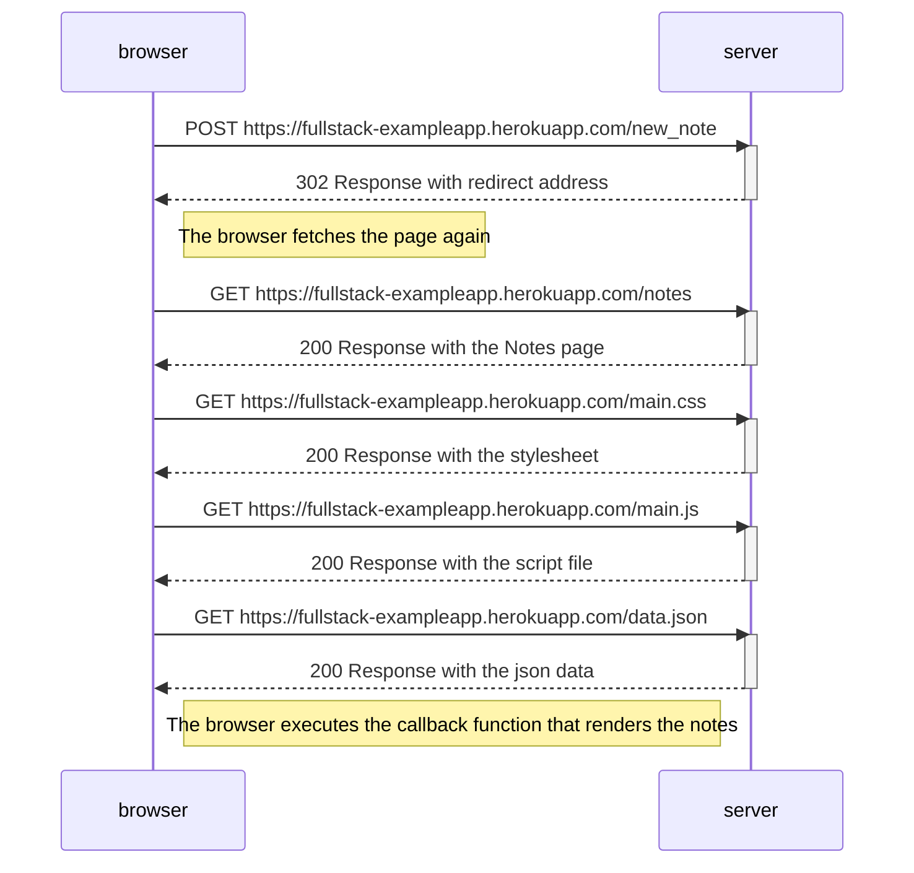

```mermaid
sequenceDiagram
    participant browser
    participant server

    browser->>server: POST https://fullstack-exampleapp.herokuapp.com/new_note
    activate server
    server-->>browser: 302 Response with redirect address
    deactivate server

    Note right of browser: The browser fetches the page again

    browser->>server: GET https://fullstack-exampleapp.herokuapp.com/notes
    activate server
    server-->>browser: 200 Response with the Notes page
    deactivate server

    browser->>server: GET https://fullstack-exampleapp.herokuapp.com/main.css
    activate server
    server-->>browser: 200 Response with the stylesheet
    deactivate server

    browser->>server: GET https://fullstack-exampleapp.herokuapp.com/main.js
    activate server
    server-->>browser: 200 Response with the script file
    deactivate server

    browser->>server: GET https://fullstack-exampleapp.herokuapp.com/data.json
    activate server
    server-->>browser: 200 Response with the json data
    deactivate server

    Note right of browser: The browser executes the callback function that renders the notes
```
